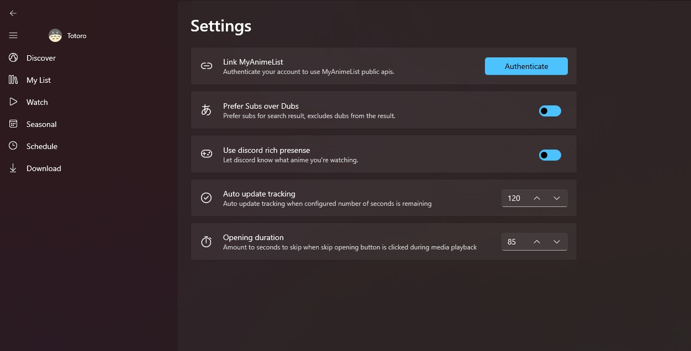
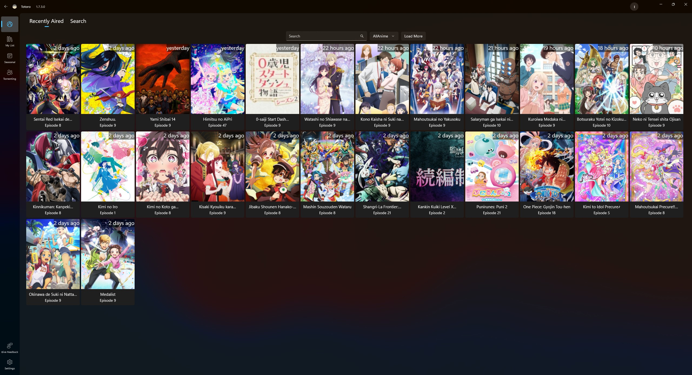
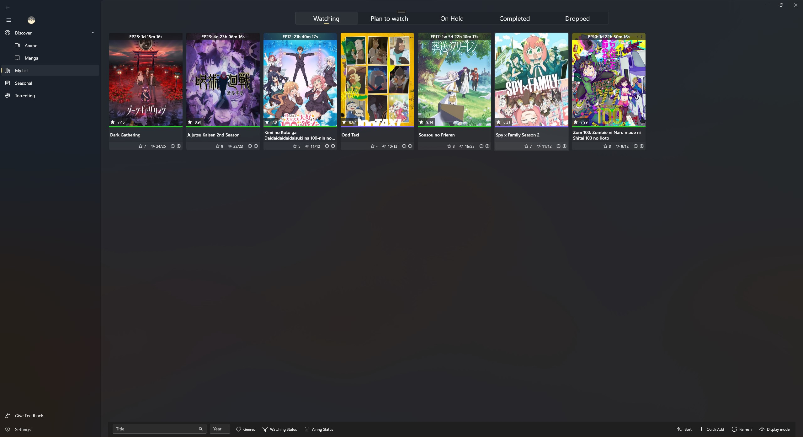
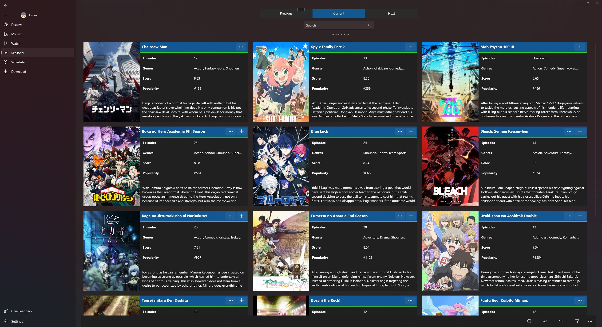
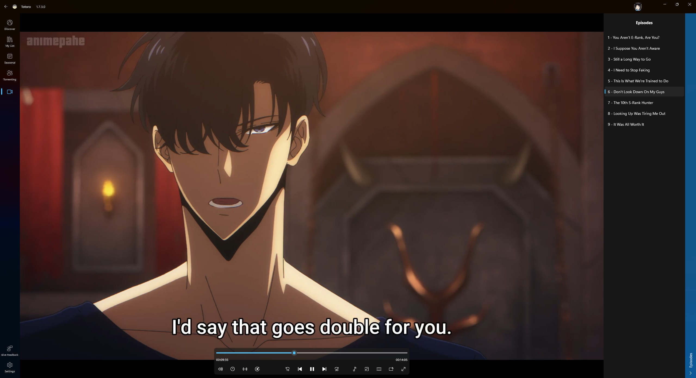

# Totoro

An app for watching and tracking anime!

## Support

Head to the [discord server](https://discord.gg/KHxdxuCjhX).

## Disclaimer

The core aim of this project is to co-relate automation and efficiency to extract what is provided to an user on the internet. Every content available in the project is hosted by external non-affiliated sources.

Any content served through this project is publicly accessible. If your site is listed in this project, the code is pretty much public. Take necessary measures to counter the exploits used to extract content in your site.

Think of this project as your normal browser, but a bit more straight-forward and specific. While an average browser makes hundreds of requests to get everything from a site, this project goes on to make requests associated with only getting the content served by the sites.

This project is to be used at the user's own risk, based on their government and laws.

This project has no control on the content it is serving, using copyrighted content from the providers is not going to be accounted for by the developer. It is the user's own risk.

### DMCA and Copyright Infrigements

This project uses client-side content access mechanisms. Hence, the copyright infrigements or DMCA in this project's regards are to be forwarded to the associated site by the associated notifier of any such claims. This is one of the main reasons the sites are listed in this project.

## Getting things started

Go to the settings page by clicking the bottom left of the application and login with your MyAnimeList account by clicking the authenticate button.

It will use the official MAL api to update your tracking.
Although you can use the application without login in with MyAnimeList, it's the recommended way to use this app.

## Screenshots

## Features

- [x] Automatically update tracking while your watching.
  - [x] MyAnimeList
  - [x] AniList
  - [x] Simkl
  - [ ] Kitsu
- [x] Resume video playback from where you last left off.
- [x] Manually update tracking
  - [x] MyAnimeList
  - [x] AniList
  - [x] Simkl
  - [ ] Kitsu
- [x] Skip openings.
- [x] Discord Rich Presense.
- [ ] Show notifications when anime you're watching airs a new episode.
