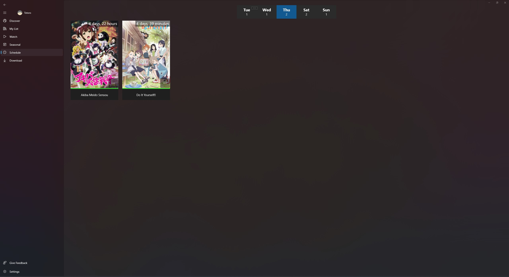

# Totoro
An app for watching and tracking anime!

## Getting things started
Go to the settings page by clicking the bottom left of the application and login with your MyAnimeList account by clicking the authenticate button.

It will use the official MAL api to update your tracking.
Although you can use the application without login in with MyAnimeList, it's the recommended way to use this app.

## Screenshots

## Features
- [X] Automatically update tracking while your watching.
    - [X] MyAnimeList
    - [ ] AniList
    - [ ] Kitsu
- [X] Resume video playback from where you last left off.
- [X] Manually update tracking
    - [X] MyAnimeList
    - [ ] AniList
    - [ ] Kitsu
- [X] Skip openings. 
- [X] Discord Rich Presense.
- [ ] Show notifications when anime you're watching airs a new episode.